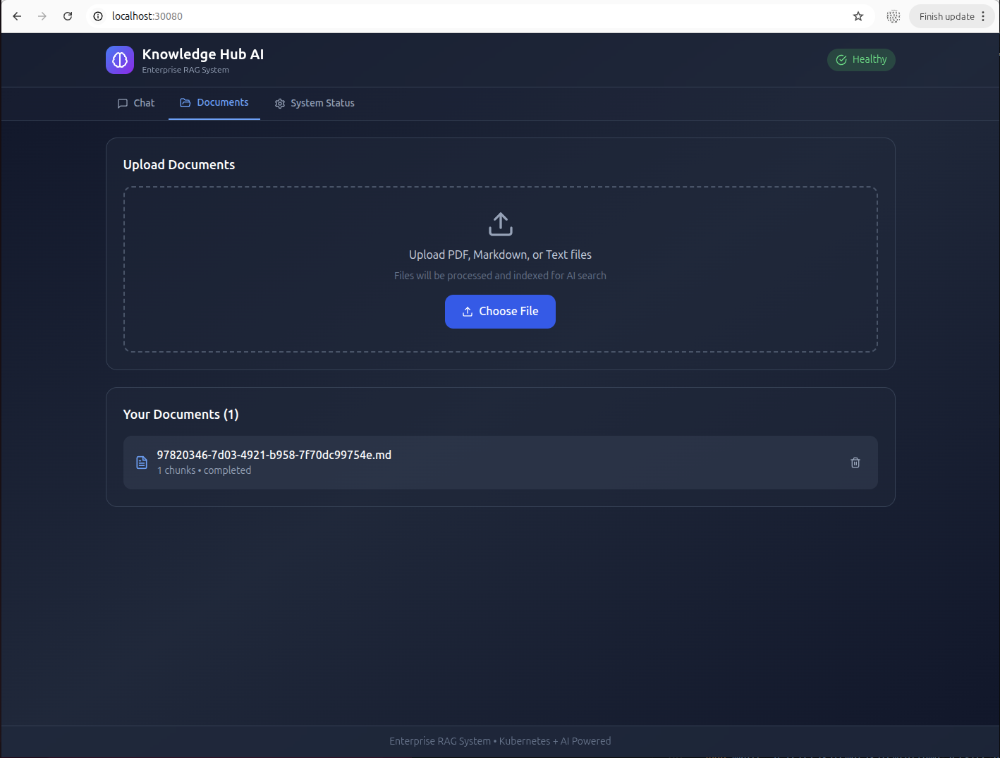
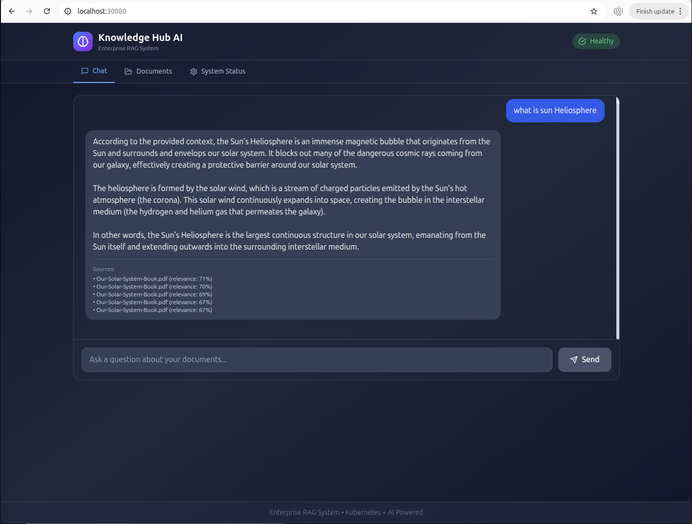
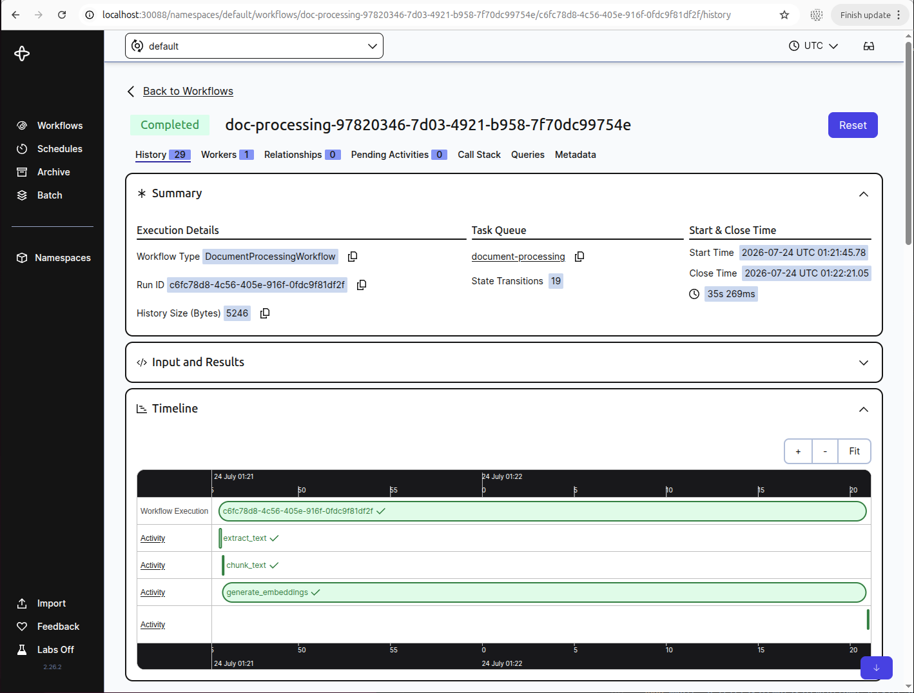
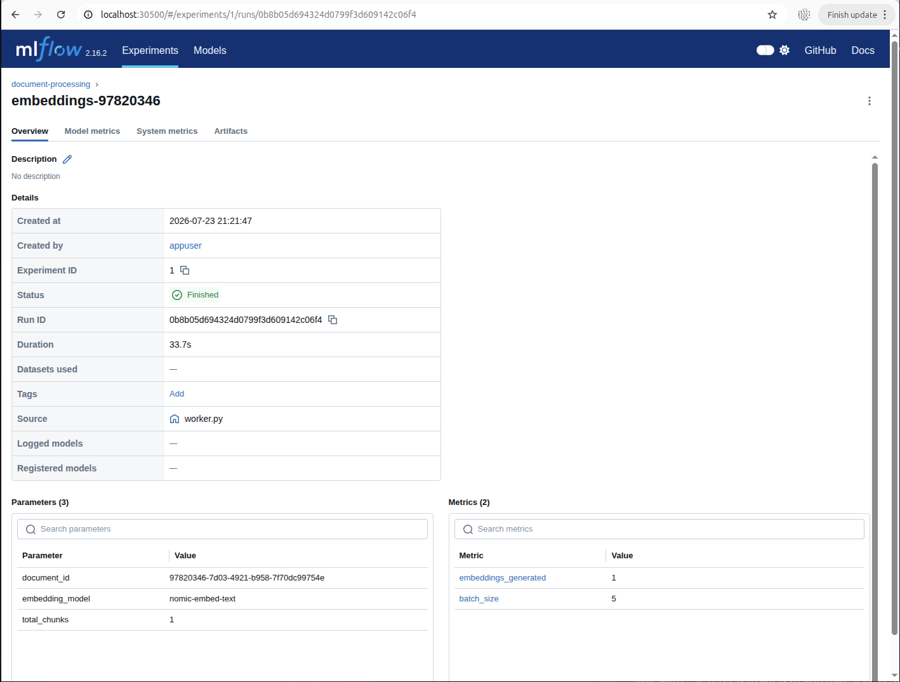

# Enterprise Knowledge Assistant

> **A production-grade Retrieval-Augmented Generation (RAG) platform showcasing Kubernetes, Helm, and cloud-native development skills**

This project demonstrates enterprise-level deployment patterns using Kubernetes orchestration, Helm package management, and modern cloud-native architecture. Users can upload technical documentation, which is automatically processed using vector embeddings and queried through a local Large Language Model.


## Features

- **Document Upload**: Support for PDF, Markdown, and TXT files
- **Automatic Processing**: Temporal workflows for reliable document processing with retry logic
- **Vector Search**: PostgreSQL with pgvector for efficient similarity search
- **Local LLM**: Ollama integration for privacy-focused inference
- **Experiment Tracking**: MLflow for monitoring processing and query metrics
- **Kubernetes Native**: Full Helm chart with operators for production deployment
- **Production Logging**: Structured logging with request tracking and correlation IDs
- **Observability**: Health checks, metrics, and workflow visualization

## Technology Stack

| Category | Technologies |
|----------|-------------|
| **Backend** | Python 3.12, FastAPI, SQLAlchemy, Alembic, Pydantic |
| **AI/ML** | Ollama, llama3, nomic-embed-text |
| **Database** | PostgreSQL 16, pgvector |
| **Workflow** | Temporal |
| **Tracking** | MLflow |
| **Infrastructure** | Docker, Kubernetes (kind), Helm |


## Architecture

```
┌─────────────┐     ┌─────────────┐     ┌─────────────┐
│   Client    │────▶│   FastAPI   │────▶│  PostgreSQL │
└─────────────┘     │   Backend   │     │  + pgvector │
                    └──────┬──────┘     └─────────────┘
                           │
              ┌────────────┼────────────┐
              ▼            ▼            ▼
        ┌──────────┐ ┌──────────┐ ┌──────────┐
        │ Temporal │ │  Ollama  │ │  MLflow  │
        │ Workflow │ │   LLM    │ │ Tracking │
        └──────────┘ └──────────┘ └──────────┘
```

## Examples

### Frontend

#### Documents Tab


#### Chat Tab


### Temporal



### MLflow



## Quick Start

### Prerequisites

- **Docker** and **Docker Compose** (for infrastructure services)
- **kubectl**, **kind**, **helm** (for Kubernetes)
- **Python 3.12+** (for backend)
- **Node.js 18+** (for frontend)
- **Ollama** (for local LLM inference)

### One-Command Setup

```bash
# Start everything (Ollama, Docker services, K8s cluster, frontend)
./scripts/start-all.sh
```

This script will:
1. Configure and start Ollama with network access
2. Pull required AI models (llama3, nomic-embed-text)
3. Start Docker services (PostgreSQL, Redis, Temporal, MLflow)
4. Create Kind cluster and load Docker images
5. Deploy application with Helm
6. Run database migrations
7. Start frontend development server

**Access URLs after startup:**
- **Frontend**: http://localhost:30080
- **Backend API**: http://localhost:30000/docs
- **Temporal UI**: http://localhost:30088
- **MLflow UI**: http://localhost:30500


### Manual Setup

1. **Configure Ollama for network access**
```bash
sudo systemctl stop ollama
sudo mkdir -p /etc/systemd/system/ollama.service.d
echo -e '[Service]\nEnvironment="OLLAMA_HOST=0.0.0.0"' | sudo tee /etc/systemd/system/ollama.service.d/override.conf
sudo systemctl daemon-reload
sudo systemctl start ollama
```

2. **Pull AI models**
```bash
ollama pull llama3
ollama pull nomic-embed-text
```

3. **Start infrastructure services**
```bash
docker compose up -d postgres redis temporal temporal-ui
```

4. **Create Kind cluster and deploy**
```bash
kind create cluster --name rag-cluster --config kind-config.yaml
docker build -f docker/backend.Dockerfile -t enterprise-rag-backend:latest .
docker build -f docker/worker.Dockerfile -t enterprise-rag-worker:latest .
kind load docker-image enterprise-rag-backend:latest enterprise-rag-worker:latest --name rag-cluster
kubectl create namespace enterprise-rag
helm install enterprise-rag ./helm/enterprise-rag -f ./helm/enterprise-rag/values-local.yaml -n enterprise-rag
```

5. **Start frontend**
```bash
cd frontend && npm install && npm run dev
```

### Access Points

| Service | URL | Description |
|---------|-----|-------------|
| **Frontend** | http://localhost:30080 | React UI for document upload and chat |
| **Backend API** | http://localhost:30000/docs | FastAPI Swagger documentation |
| **Temporal UI** | http://localhost:30088 | Workflow execution monitoring |
| **MLflow UI** | http://localhost:30500 | Experiment tracking and metrics |

## API Endpoints

| Method | Endpoint | Description |
|--------|----------|-------------|
| `GET` | `/api/v1/health` | Health check |
| `POST` | `/api/v1/documents` | Upload document |
| `GET` | `/api/v1/documents` | List documents |
| `GET` | `/api/v1/documents/{id}` | Get document details |
| `DELETE` | `/api/v1/documents/{id}` | Delete document |
| `POST` | `/api/v1/chat` | Ask a question |

### Example: Upload a Document

```bash
curl -X POST "http://localhost:8000/api/v1/documents" \
  -H "Content-Type: multipart/form-data" \
  -F "file=@documentation.pdf"
```

### Example: Ask a Question

```bash
curl -X POST "http://localhost:8000/api/v1/chat" \
  -H "Content-Type: application/json" \
  -d '{"query": "What are the main features?", "top_k": 5}'
```

## Kubernetes Deployment

### Create a kind cluster

```bash
kind create cluster --name rag-cluster
```

### Build and load images

```bash
docker build -f docker/backend.Dockerfile -t enterprise-rag-backend:latest .
docker build -f docker/worker.Dockerfile -t enterprise-rag-worker:latest .
kind load docker-image enterprise-rag-backend:latest --name rag-cluster
kind load docker-image enterprise-rag-worker:latest --name rag-cluster
```

### Deploy with Helm

```bash
cd helm
helm dependency update enterprise-rag
helm install enterprise-rag ./enterprise-rag
```

### Verify deployment

```bash
kubectl get pods
kubectl get services
```

## Project Structure

```
knowledgeHubAI/
├── backend/
│   ├── api/              # REST API endpoints and schemas
│   ├── config/           # Application configuration
│   ├── database/         # Database connection and session management
│   ├── models/           # SQLAlchemy models
│   ├── services/         # Business logic services
│   ├── temporal/         # Temporal workflows and activities
│   ├── mlflow_tracking/  # MLflow integration
│   └── main.py           # FastAPI application entry point
├── docker/               # Dockerfiles
├── helm/                 # Helm charts
```


## Document Processing Pipeline

When a document is uploaded, Temporal orchestrates the following workflow:

1. **Extract Text** - Parse PDF/Markdown/TXT content
2. **Chunk Text** - Split into overlapping chunks (default: 500 chars, 50 overlap)
3. **Generate Embeddings** - Create vector embeddings using nomic-embed-text
4. **Store Vectors** - Save embeddings to PostgreSQL with pgvector
5. **Log Metrics** - Record processing stats in MLflow

The workflow automatically retries failed steps with exponential backoff.

## RAG Query Flow

1. User submits a question via `/api/v1/chat`
2. Query is embedded using nomic-embed-text
3. pgvector performs cosine similarity search
4. Top-k relevant chunks are retrieved
5. Context + query sent to llama3 via Ollama
6. Response returned with source citations
7. Metrics logged to MLflow

## Configuration

All configuration is managed via environment variables. See `.env.example` for available options.

Key configurations:
- `CHUNK_SIZE`: Text chunk size (default: 500)
- `CHUNK_OVERLAP`: Overlap between chunks (default: 50)
- `TOP_K_RESULTS`: Number of chunks to retrieve (default: 5)
- `LLM_MODEL`: Ollama model for generation (default: llama3)
- `EMBEDDING_MODEL`: Model for embeddings (default: nomic-embed-text)

